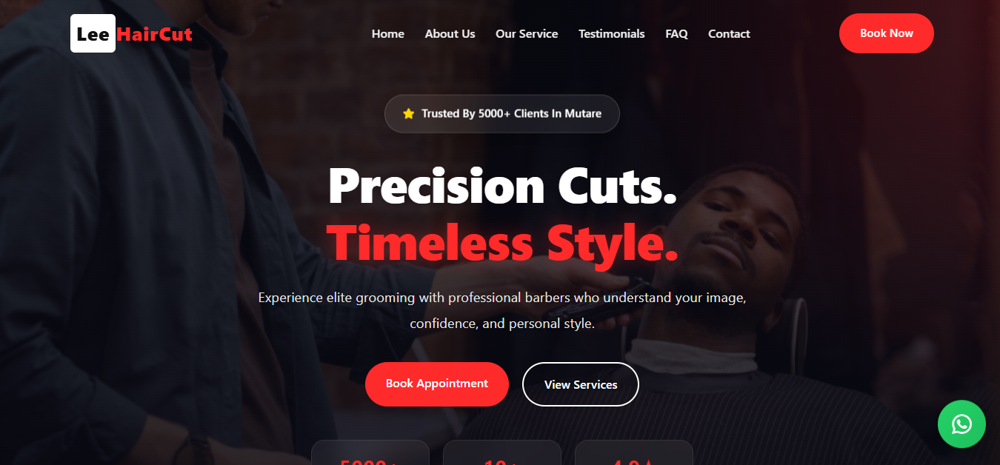

<h1 align="center">LeeHairCut - Barbershop Website</h1>

<hr>

<p align="center">
A fully responsive premium barbershop website,<br>
Designed for all devices using HTML, CSS, and JavaScript.
</p>

<p align="center">
➡️ <a href="#" target="_blank"><strong>Live Demo</strong></a>
</p>

<br>

## Demo Screenshots



---

## Features

- Premium modern UI/UX design  
- Fully responsive layout for all screen sizes  
- Animated hero background slider  
- Sticky navbar with scroll effect  
- Mobile navigation menu  
- Booking modal with success notification  
- WhatsApp appointment integration  
- Services modal popup system  
- Auto testimonial slider  
- FAQ accordion interaction  
- Contact form toast notification  
- Smooth animations & hover effects  

---

## Technologies Used

- HTML5  
- CSS3  
- JavaScript (Vanilla JS)  
- Font Awesome  
- Google Fonts  

---

## Folder Structure

```bash
LeeHairCut/
│── index.html
│── style.css
│── script.js
│── imgs/
│   ├── ReadMe.png
│   ├── hero1.png
│   ├── hero2.png
│   └── hero3.png
